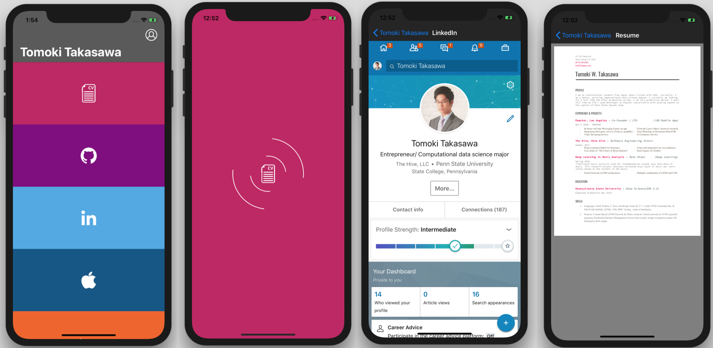

# iOS-GoodCodeExerciseSample

This project is a sample project to practice writing clean and manageable protocol oriented code. It is an app that contains all information necessary for candidates who is applying for the job. It may eliminate the need for candidates to keep submitting applications to multiple website over and over, if standardized. In this sample, I have added Resume, Github link, LinkedIn link, link for my app, Business Insider article featureing my app, and transcript. Please take a look!
##### Note
* Please feel free to run it on your iPhone!
* Time of development: 20 hrs


## Sample Images


## Data Model
### UserData
This is responsible for storing user's attributes.
### ApplicationMaterial
This is enum for differet types of application materials such as linkedin, resume, etc.

## Network Layer

#### UserNetwork
This is model object responsible for querying, updating, and login of UserData object. It executes all networking stuff for UserData object.
```
protocol UserNetwork {

    var user: UserData? { get set }
    
    func login(email: String, password: String, completion: @escaping (_ user: UserData?, _ error: Error?) -> Void)
    func queryUser(userId: String, completion: @escaping (_ user: UserData?, _ error: Error?) -> Void)
    func updateUserInfo(user: UserData, completion: @escaping (_ user: UserData?, _ error: Error?) -> Void)
    
}
```

This protocol requires NetworkManager to make actual call to the database. The description about NetworkManager is in the next sub-section.
```
extension UserNetwork where Self: NetworkManager {
    func login(email: String, password: String, completion: @escaping (_ user: UserData? , _ error: Error?) -> Void) {
        
//        Auth.auth().createUser(withEmail: email, password: password) { (user, error) in
//        }
        
    }
    
    
    func updateUserInfo(user: UserData, completion: @escaping (_ user: UserData?, _ error: Error?) -> Void) {
        
        self.fetchFirebase(endpoint: UserEndpoints.updateUser(user: user)) { (user: UserData?, error: Error?) in
            completion(user, error)
        }
    }
    
    func queryUser(userId: String, completion: @escaping (_ user: UserData?, _ error: Error?) -> Void){
        
        self.fetchFirebase(endpoint: UserEndpoints.queryUser(userId: userId)) { (userData: UserData?, error: Error?) in
            
            completion(userData, error)
            
        }
    }
}
```

Note: (Explanation to fetchFirebase and UserEndpoints.queryUser(userId: userId) is in later section.)


#### NetworkManager
This is responsible for communicating with Firebase real time database. As you can see from the example in the prevous sub-section, protocols such as UserNetwork is used as interface for NetworkManager. NetworkManager is the one that is actually making a call to Firebase.
```
protocol NetworkManager {
    var firebaseDBConnection: DatabaseReference { get set }
    
    func fetchFirebase<T: Decodable>(endpoint: FirebaseEndpoints, completion: @escaping (_ result: T?, _ error: Error?) -> Void)
    func fetchAuth(endpoint: FirebaseEndpoints, completion: @escaping (_ id: String?, _ error: Error?) -> Void)
    func firebaseAtomicStore(endpoints: [FirebaseEndpoints], completion: @escaping ( _ success: Bool) -> Void)
}
```


One of the functions here, fetchFirebase, is solely responsible for communicating with real time database.  Clever use of endpoint allows fetchFirebase to stay absctract, so it can be reused over and over. The description for FirebaseEndpoints is in the later subsection.

##### fetchFirebase
This function is an abstract function which can be used for any calls to firebase. Variables that needs to be changed based on each network calls can be switched using endpoints. Furthermore, it only returns generic type variable that is gurenteed to be decodable. In this example, it is responsibility of UserNetwork to convert thie generic type variable to UserData variable. 

###### Path
path can be created by combining variable realtimeRef protocol and path of endpoint. realtimeRef is a variable of NetworkManager and fixed for all kinds of call. Endpoint is injected to function every time the network call is made, which can be unique for every calls.
```
var realtimeRef: DatabaseReference!
        
if let path = endpoint.path {
    realtimeRef = self.firebaseDBConnection.child(path)
}else{
    realtimeRef = self.firebaseDBConnection
}
```

###### Querying or updating
Whether or not the call is read can be determined based on the body of endpoint. When you are only reading from firebase, body must be empty. On the other hand, body has to exist if you are writing to database.
```
if let body = endpoint.body {

    // If body exists, it is write operation

    realtimeRef.setValue(body)

    if let storedData = body as? T{
        completion(storedData, nil)
    }else{
        completion(nil, nil)
    }
    
} else {

    // Else, it is read operation
    
    realtimeRef.observeSingleEvent(of: .value, with: { snapshot in

        guard let value = snapshot.value else { return }

        do {

            let model = try FirebaseDecoder().decode(T.self, from: value)
            completion(model, nil)

        } catch let error {

            completion(nil, error)

        }
    })
}
```


#### SampleNetwork
All of Network objects listed above are attached to this protocol. As the app gets larger and more complex, you can attach more Networking Protocols here.
```
protocol SampleNetwork: NetworkManager, UserNetwork { } 
```


#### Top Level Network Layer

SampleNetwork can be used as a singleton on Global struct like following:
```
struct Global {

    class Network: SampleNetwork {
    
        var firebaseDBConnection: DatabaseReference
        var user: UserData?
        //initialize necessary information here.
    }
    
    class DemoNetwork: SampleNetwork {
    
        var firebaseDBConnection: DatabaseReference
        var user: UserData?
    }
    
    static var network: SampleNetwork = Network()
}
```

This Global.network should be injected to the first ViewController upon initialization. Afterwards, it can be passed to any other ViewControllers that needs to make network calls. 


#### Unit Testing

If you'd like to see UI of the app without making real network calls to Firebase, you can use DemoNetowrk and query from local json. This is convenient for the testing purpose. For example, it enables you to test how UI interact with new data without actually updating real time database. 


Depending on whether or not you would make network call to firebase, you might want to have different implementation of NetworkManager like following:
```
extension NetworkManager where Self: Global.Network {
    // real call to firebase
    // Please check out the project, it is too long for Readme
}
extension NetworkManager where Self: Global.DemoNetwork {
    //test
}
```


In order to switch to DemoNetwork, you'd simpley add
```
if isDemo {
    Global.network = Global.DemoNetwork()
}
```
in AppDelegate.


### Endpoints
As briefly mentioned earlier, a clever use of endpoints is the reason why I could keep reusing one function to query / update any data from real time database.

#### FirebaseEndpoints
This protocol promises variables needed to make call to database will be provided. By changing the values of those variables of endpoint and injecting them to fetchFirebase() function in NetworkManager, you can reuse fetchFirebase() function for any calls to real time database.
```
protocol FirebaseEndpoints {
    
    var path: String? { get }
    var body: Any? { get }
    
    func toData<T: Encodable>(object: T) -> Any?
    
}
```
Notice that, you can use 'body' to distinguish whether a call is read or write. (When you would like to read from database, your 'body' variable is nil.)

This protocol also gurantees a method which takes Encodable object and encode for firebase real time database
```
extension FirebaseEndpoints {
    func toData<T: Encodable>(object: T) -> Any? {
        let encoder = FirebaseEncoder()
        do{
            let jsonData = try encoder.encode(object)
            return jsonData
        }catch{
            return nil
        }
    }
}
```


Generally, there are many different types of calls you have to make to if the app becomes more complex. Therefore, it may be a good practice to group endpoints by theme. 


For example, all the UserData related endpoints might be grouped as following:
```
enum UserEndpoints: FirebaseEndpoints {
    
    case login
    case queryUser(userId: String)
    case updateUser(user: UserData)
    
    var path: String? {
        switch self {
        case .updateUser(let user):
            return "Users/\(user.id)"
        case .queryUser(let userId):
            return "Users/\(userId)"
        default:
            return nil
        }
    }
    
    var body: Any? {
        switch self {
        case .updateUser(let user):
            return self.toData(object: user)
        default:
            return nil
        }
    }
    
}
```


## Displayables

Displayable is responsible for providing data that is needed to draw a view on ViewController.

### ApplicationDisplayable

This is responsible for providing data about application materials. Each UserApplicationData object comforms this protocol. 
```
protocol ApplicationDisplayable {

    var name: String { get }
    var url: String { get }
    var icon: UIImage { get }
    var themeColor: UIColor { get }
    
}
```


This protocol is an interface for concrete object, UserApplicationData. By using such a protocol, ViewController does not need to know anything about concrete instance of data object to draw a view. Instead, it has ApplicationDisplayable to make sure that all necessary data would be provided.
```
extension UserApplicationData: ApplicationDisplayable {
    //may need to supply data that is not in UserApplicationData, such as computed values here
}
```


## Stylable

Stylable is responsible for styling views. It can be the composition of multiple protocols such as ColorStyles or FontStyles, which may look like this:
```
protocol Stylable: ColorStyles, FontStyles { }

protocol ColorStyles {
    
    func getMainColor() -> UIColor
    func getSecondaryColor() -> UIColor
    
}

protocol FontStyles {
    // font stuff
}
```


It can be customized for any objects by making extension, and can be used for any objects. 

```
class DetailViewController: UIViewController, Stylable {

    // You can call any functions in Stylable after init method now.
    
    override func viewDidLoad() {
        super.viewDidLoad()
        
        self.view.backgroundColor = self.getMainColor()
    }
    
}

extension Stylable where Self: DetailViewController {

    func getMainColor() -> UIColor {
        return UIColor.white
    }

}
```


## ViewControllers

### RootTableViewController
This ViewController is responsible for initiating a network call from Global.network, which is injected in the initialization. This network object can be injected to other ViewController, which requires to make netwrok call, if needed. 
```
init (network: SampleNetwork) {

    self.network = network
    
}
```


Then, you can simply call any network call as following:
```
self.network.queryUser(userId: "User_Id_Goes_Here") { (user: UserData?, error: Error?) in
    if error != nil {
    
        return
                
    }else{
    
        //Now, you have user data
    }
}
```


Here, it is important not to call any functions in NetworkManager directly. The whole purpose of UserNetwork is to offer a layers of abstractions. This way, code remains more transparent, and also protocols such as NetworkManager can remain abstract to be used over and over.


### DetailViewController
This ViewController just displays WkWebView based on URL that is injected in initialization method. Both website and pdf are displayed in this manner. 


